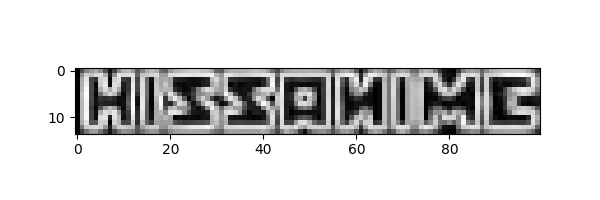

# waterdown

Detecting, reconstructing, and masking image watermarks with numpy

## Project goals

- [ ] Use numpy to detect and reproduce the original watermark (produce output from which to load for future use)
  - [x] ⇒ [img/doc/wm_greyscale_multi.gif](img/doc/wm_greyscale_multi.gif)
  - [ ] ⇒ consensus watermark estimate TBC
- [ ] Inpaint/offset the watermark region so as to unmark the image
- [x] Calculate the alpha opacity of the watermark
  - 24/255, or around 9.4%
- [ ] Apply to a gif (of a different size to the still images)

## Demo

- In part 1 of this demo, it is explained how watermarks are extracted from images
- In part 2, the extracted watermarks are loaded from file and used as a mask on new images

### 1: Extracting watermarks

So far all I've done is obtain some still/animated images (from
[_Kirby Of The Stars_](https://en.wikipedia.org/wiki/Kirby_of_the_Stars)!)
and to focus on the watermark region in question.


The file `kirby003_01a.png` can be used to extract the binary watermark,
since it falls in a region of black screen fill.

```py
img = read_image('kirby003_01a.png')
watered = img[6:20, 9:109]
gr_wm = rgb2grey(watered)
```

The values in `gr_wm` are a greyscale equivalent to the RGB(A) values
given by `imageio.imread` (i.e., the watermark is white with low opacity,
so there's no point representing it as 3 colours).

An example value can be shown to be simply a decimal interpretation of RGB:

- `watered[10,10]` ⇒ `Array([ 24,  24,  24, 255], dtype=uint8)`
- `gr_wm[10,10]` ⇒ `0.09411764705882353`
- `24/255` ⇒ `0.09411764705882353`

Watermark removal should then just be a matter of offsetting the value stored
above in the variable `watered`...

```py
normed = gr_wm * (1/np.max(gr_wm))
plt.imshow(normed, cmap=plt.get_cmap('gray'))
plt.show()
# fig = plt.figure(figsize=(6,2))
# plt.imshow(normed, cmap=plt.get_cmap('gray'))
# fig.savefig('../img/doc/wm_greyscale.png')
```


Then for greater accuracy, do it twice more:

```py
img2 = read_image('kirby003_01b.png')
img3 = read_image('kirby003_01c.png')
gr_wm2 = rgb2grey(img2[6:20, 9:109])
gr_wm3 = rgb2grey(img3[6:20, 9:109])
normed2 = gr_wm2 * (1/np.max(gr_wm2))
normed3 = gr_wm3 * (1/np.max(gr_wm3))
# assert np.min(normed2) == np.min(normed3) == 0
# assert np.max(normed2) == np.max(normed3) == 1

fig=plt.figure(figsize=(6, 4))
fig.add_subplot(3,1,1)
plt.imshow(normed, cmap=plt.get_cmap('gray'))
fig.add_subplot(3,1,2)
plt.imshow(normed2, cmap=plt.get_cmap('gray'))
fig.add_subplot(3,1,3)
plt.imshow(normed3, cmap=plt.get_cmap('gray'))
fig.savefig('../img/doc/multi_wm_greyscale.png')
```


...and as animated GIF:

```py
fig = plt.figure(figsize=(6,2))
plt.imshow(normed2, cmap=plt.get_cmap('gray'))
fig.savefig('../img/doc/wm2_greyscale.png')

fig = plt.figure(figsize=(6,2))
plt.imshow(normed3, cmap=plt.get_cmap('gray'))
fig.savefig('../img/doc/wm3_greyscale.png')

from subprocess import call
call(['convert', '../img/doc/wm*_grey*.png', '../img/doc/wm_greyscale.gif'])
```


...for good measure, do the same for a couple non-black backgrounded,
dark grey b/g images (`kirby003_03a.png` and `kirby003_03b.png`),
along with a black b/g fade-out screen (`kirby003_04.png`).

```py
img4 = read_image('kirby003_03a.png')
img5 = read_image('kirby003_03b.png')
img6 = read_image('kirby003_04.png')
gr_wm4 = rgb2grey(img4[6:20, 9:109])
gr_wm5 = rgb2grey(img5[6:20, 9:109])
gr_wm6 = rgb2grey(img6[6:20, 9:109])
prenorm4 = gr_wm4 - (np.min(gr_wm4) * 1.4)
prenorm5 = gr_wm5 - (np.min(gr_wm5) * 1.4)
# Increase the background minimisation by a factor of 40%,
# clipping any values that dip below zero (a_max=None as not needed)
# Otherwise 4 and 5 end up with a light grey watermark background
normed4 = np.clip(prenorm4, 0, None) * (1/np.max(prenorm4))
normed5 = np.clip(prenorm5, 0, None) * (1/np.max(prenorm5))
normed6 = gr_wm6 * (1/np.max(gr_wm6))
# assert np.min(normed4) == np.min(normed5) == np.min(normed6) == 0
# assert np.max(normed4) == np.max(normed5) == np.max(normed6) == 1
```

...and an animation with all 6:

```py
call(['convert', '../img/doc/wm*_grey*.png', '../img/doc/wm_greyscale_all.gif'])
```


However there needs to be a single consensus watermark, using these sampled images.
This can then be used across images to mask the watermark, as well as reloaded from a single file.

_Google Research_ published [a 2017 CVPR paper on this topic](https://ai.googleblog.com/2017/08/making-visible-watermarks-more-effective.html)
([project site](https://watermark-cvpr17.github.io/), using hundreds of samples (at higher resolution)
with excellent results, and went with the median.

- That paper is really worth reading, and presents this as a 'multi-image matting' optimisation problem.
- Unlike their paper, I have a blank backgrounded watermarked image, so can avoid the 'chicken and egg' problem
  of simultaneous watermark estimation and detection (which they resolve by iterated rounds of estimation/detection)
- Their paper doesn't describe how they get the image gradient (e.g. Sobel vs. Canny). I opt to convolve a 
  \[2D\] [Sobel operator](https://en.wikipedia.org/wiki/Sobel_operator) horizontally and vertically,
  then take the hypotenuse to get the magnitude ([as here](https://stackoverflow.com/a/7186582/2668831)).
  - I note that the GR team's method calculates median of the 2 directions independently, _then_ takes the magnitude
    (rather than taking the median of 2D Sobels per image, i.e. `mag = np.hypot(median_dx, median_dy)`).

N.B. - `get_grads` returns a tuple `(dx, dy)`, whereas `get_grad` (singular) takes their magnitude (the hypotenuse),
below the `grads` variable is a list of six `(dx, dy)` tuples, from which independent medians are taken.

```py
imgs = [normed, normed2, normed3, normed4, normed5, normed6]
grads = [get_grads(i) for i in imgs]
med_dx = np.median([m[0] for m in grads], 0)
med_dy = np.median([m[1] for m in grads], 0)
med_mag = np.hypot(med_dx, med_dy)
```



### 2: Removing watermarks

TBC...
