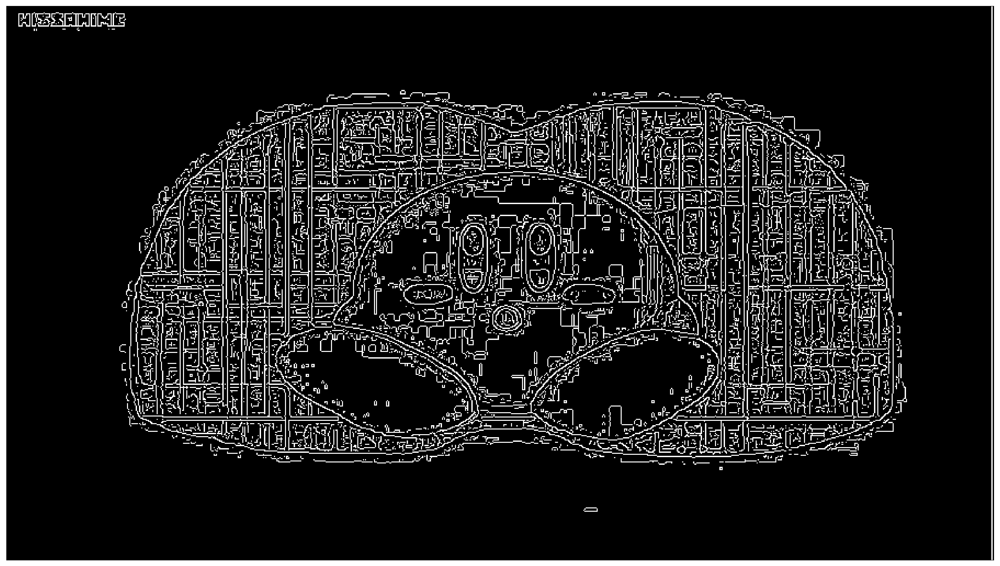

# waterdown

Detecting, reconstructing, and masking image watermarks with numpy

### Requirements:

- `numpy`
- `matplotlib`
- `imageio`
- `scipy`
- `cv2` (I'm using OpenCV 4.0)
- `skimage`

## Project goals

- [x] Use numpy to estimate the original watermark (and produce output from which to load it for future use)
  - [x] ⇒ [img/doc/wm_greyscale_multi.gif](img/doc/wm_greyscale_multi.gif)
  - [x] ⇒ [data/est_grad_wmark.p](data/est_grad_wmark.p)
- [ ] Inpaint/offset the watermark region so as to unmark the image
- [x] Calculate the alpha opacity of the watermark
  - 24/255, or around 9.4%
- [ ] Apply to a gif (of a different size to the still images)

## Demo

- In part 1 of this demo, it is explained how watermarks are extracted from images (estimated)
- In part 2, the estimated watermark [image gradient] is used to detect the watermark in new images

### 1: Extracting watermarks

So far all I've done is obtain some still/animated images (from
[_Kirby Of The Stars_](https://en.wikipedia.org/wiki/Kirby_of_the_Stars)!)
and to focus on the watermark region in question.


The file `kirby003_01a.png` can be used to extract the binary watermark,
since it falls in a region of black screen fill.

```py
img = read_image('kirby003_01a.png')
watered = img[6:20, 9:109]
gr_wm = rgb2grey(watered)
```

The values in `gr_wm` are a greyscale equivalent to the RGB(A) values
given by `imageio.imread` (i.e., the watermark is white with low opacity,
so there's no point representing it as 3 colours).

An example value can be shown to be simply a decimal interpretation of RGB:

- `watered[10,10]` ⇒ `Array([ 24,  24,  24, 255], dtype=uint8)`
- `gr_wm[10,10]` ⇒ `0.09411764705882353`
- `24/255` ⇒ `0.09411764705882353`

Watermark removal should then just be a matter of offsetting the value stored
above in the variable `watered`...

```py
normed = gr_wm * (1/np.max(gr_wm))
plt.imshow(normed, cmap=plt.get_cmap('gray'))
plt.show()
# fig = plt.figure(figsize=(6,2))
# plt.imshow(normed, cmap=plt.get_cmap('gray'))
# fig.savefig('../img/doc/wm_greyscale.png')
```


Then for greater accuracy, do it twice more:

```py
img2 = read_image('kirby003_01b.png')
img3 = read_image('kirby003_01c.png')
gr_wm2 = rgb2grey(img2[6:20, 9:109])
gr_wm3 = rgb2grey(img3[6:20, 9:109])
normed2 = gr_wm2 * (1/np.max(gr_wm2))
normed3 = gr_wm3 * (1/np.max(gr_wm3))
# assert np.min(normed2) == np.min(normed3) == 0
# assert np.max(normed2) == np.max(normed3) == 1

fig=plt.figure(figsize=(6, 4))
fig.add_subplot(3,1,1)
plt.imshow(normed, cmap=plt.get_cmap('gray'))
fig.add_subplot(3,1,2)
plt.imshow(normed2, cmap=plt.get_cmap('gray'))
fig.add_subplot(3,1,3)
plt.imshow(normed3, cmap=plt.get_cmap('gray'))
fig.savefig('../img/doc/multi_wm_greyscale.png')
```


...and as animated GIF:

```py
fig = plt.figure(figsize=(6,2))
plt.imshow(normed2, cmap=plt.get_cmap('gray'))
fig.savefig('../img/doc/wm2_greyscale.png')

fig = plt.figure(figsize=(6,2))
plt.imshow(normed3, cmap=plt.get_cmap('gray'))
fig.savefig('../img/doc/wm3_greyscale.png')

from subprocess import call
call(['convert', '../img/doc/wm*_grey*.png', '../img/doc/wm_greyscale.gif'])
```


...for good measure, do the same for a couple non-black backgrounded,
dark grey b/g images (`kirby003_03a.png` and `kirby003_03b.png`),
along with a black b/g fade-out screen (`kirby003_04.png`).

```py
img4 = read_image('kirby003_03a.png')
img5 = read_image('kirby003_03b.png')
img6 = read_image('kirby003_04.png')
gr_wm4 = rgb2grey(img4[6:20, 9:109])
gr_wm5 = rgb2grey(img5[6:20, 9:109])
gr_wm6 = rgb2grey(img6[6:20, 9:109])
prenorm4 = gr_wm4 - (np.min(gr_wm4) * 1.4)
prenorm5 = gr_wm5 - (np.min(gr_wm5) * 1.4)
# Increase the background minimisation by a factor of 40%,
# clipping any values that dip below zero (a_max=None as not needed)
# Otherwise 4 and 5 end up with a light grey watermark background
normed4 = np.clip(prenorm4, 0, None) * (1/np.max(prenorm4))
normed5 = np.clip(prenorm5, 0, None) * (1/np.max(prenorm5))
normed6 = gr_wm6 * (1/np.max(gr_wm6))
# assert np.min(normed4) == np.min(normed5) == np.min(normed6) == 0
# assert np.max(normed4) == np.max(normed5) == np.max(normed6) == 1
```

...and an animation with all 6:

```py
call(['convert', '../img/doc/wm*_grey*.png', '../img/doc/wm_greyscale_all.gif'])
```


However there needs to be a single consensus watermark, using these sampled images.
This can then be used across images to mask the watermark, as well as reloaded from a single file.

_Google Research_ published [a 2017 CVPR paper on this topic](https://ai.googleblog.com/2017/08/making-visible-watermarks-more-effective.html)
([project site](https://watermark-cvpr17.github.io/), using hundreds of samples (at higher resolution)
with excellent results, and went with the median.

- That paper is really worth reading, and presents this as a 'multi-image matting' optimisation problem.
- Unlike their paper, I have a blank backgrounded watermarked image, so can avoid the 'chicken and egg' problem
  of simultaneous watermark estimation and detection (which they resolve by iterated rounds of estimation/detection)
- Their paper doesn't describe how they get the image gradient (e.g. Sobel vs. Scharr derivative). I opt to convolve a 
  \[2D\] [Sobel operator](https://en.wikipedia.org/wiki/Sobel_operator) horizontally and vertically,
  then take the hypotenuse to get the magnitude ([as here](https://stackoverflow.com/a/7186582/2668831)).
  - Element-wise, the hypotenuse is equal to the square root of squared dx plus squared dy
    (see [numpy.hypot](https://docs.scipy.org/doc/numpy/reference/generated/numpy.hypot.html) docs/the
    [OpenCV Canny edge detection tutorial](https://docs.opencv.org/4.0.0/da/d22/tutorial_py_canny.html) for more info)
  - I note that the GR team's method calculates median of the 2 directions independently, _then_ takes the magnitude
    (rather than taking the median of 2D Sobels per image, i.e. `mag = np.hypot(median_dx, median_dy)`).
- Their paper specifies a "0.4 threshold" for the Canny edge detection used to find a bounding box on the watermark,
  despite the Canny algorithm (to the best of my understanding) taking 2 threshold parameters (min and max)
  - I think this actually refers to the sigma value demonstrated in [this blog post](https://www.pyimagesearch.com/2015/04/06/zero-parameter-automatic-canny-edge-detection-with-python-and-opencv/),
    i.e. upper/lower are set at +/- 40% of the median of the single channel pixel intensities (the post notes that
    33% is often optimal, which makes 0.4 a reasonable choice).
- The image gradients are used to obtain the "initial matted watermark" by "Poisson reconstruction", which appears
  to be a reference to either:
  - a 2003 SIGGRAPH paper from Microsoft Research,
    [_Poisson Image Editing_](https://www.cs.virginia.edu/~connelly/class/2014/comp_photo/proj2/poisson.pdf),
  the breadth of applications of which are summarised in this 2017 blog post:
  [_Some Variational Image Processing: Poisson Image Editing and its applications in Python_](https://sandipanweb.wordpress.com/2017/10/03/some-variational-image-processing-possion-image-editing-and-its-applications/)
  - a 2004 SIGGRAPH paper that _"rather than solving the Poisson PDEs… directly minimise a variational problem"_,
    covered in [Szeliski](http://szeliski.org/Book/drafts/SzeliskiBook_20100903_draft.pdf#page=482) (pp. 460-1),
    [_Interactive Digital Photomontage_](http://kneecap.cs.berkeley.edu/papers/photomontage/photomontage.pdf)
  - ...or (perhaps more likely, but I can't find a reference) a 2D version of what is known as "Poisson surface reconstruction",
    in which point clouds or a mesh is derived from points (which seems most in line with the concept of image reconstruction,
    the above 2 papers are mainly about 'blending').
    - Wikipedia [has a section on this technique](https://en.wikipedia.org/wiki/Geometry_processing#Poisson_reconstruction_from_surface_points_to_mesh)

N.B. - `get_grads` returns a tuple `(dx, dy)`, whereas `get_grad` (singular) takes their magnitude (the hypotenuse),
below the `grads` variable is a list of six `(dx, dy)` tuples, from which independent medians are taken.

```py
imgs = [normed, normed2, normed3, normed4, normed5, normed6]
grads = [get_grads(i) for i in imgs]
med_dx = np.median([m[0] for m in grads], 0)
med_dy = np.median([m[1] for m in grads], 0)
med_mag = np.hypot(med_dx, med_dy)
```


For now at least, I'm just going to take this as the estimate (since I can't figure out how to do
"Poisson reconstruction", and the Google researchers don't cite an implementation to look up.

Saving this estimate in the `data` directory now, note that read/write modes for pickle `load`/`dump`
must be 'rb'/'wb' not just 'r'/'w' (the b stands for binary):

```py
import pickle
pickle_file = open('../data/est_grad_wmark.p', 'wb')
pickle.dump(med_mag, pickle_file)
```

### 2: Watermark detection

Following the guidance of Dekel et al. still, the next step is as follows:

> Given the current estimate ∇Ŵm, we detect the watermark in each of the images using Chamfer
distance commonly used for template matching in object detection and recognition. Specifically,
for a given watermarked image, we obtain a verbose edge map (using Canny edge detector), and
compute its Euclidean distance transform, which is then convolved with ∇Ŵm (flipped horizontally
and vertically) to get the Chamfer distance from each pixel to the closest edge. Lastly, the
watermark position is taken to be the pixel with minimum distance in the map. We found this
detection method to be very robust, providing high detection rates for diverse watermarks
and different opacity levels.

So firstly, we run Canny edge detection (N.B. OpenCV 4.0 was released in early 2019, and OpenCV
recently became pip installable - so [no trouble](https://www.pyimagesearch.com/2018/09/19/pip-install-opencv/)
to `pip` install it within `virtualenv`).

```py
# read in image (with black b/g behind watermark) as greyscale & uint8 dtype
kirby = read_image('../img/kirby003_01a.png', grey=True, uint8=True)
edges = auto_canny(kirby)
save_image(edges, (30,17), '../img/doc/canny_demo.png')
```



Next compute its Euclidean distance transform and convolve this with the estimated watermark
(flipped horizontally and vertically). The watermark position is the pixel with minimum distance in the map.

- This section was helpfully explained [here](https://stackoverflow.com/a/53040334/2668831) that this is
  _cross-correlation_ with the image
- At first I understand from my reading of the paper that this was supposed to be the edge map of the gradient,
  not the edge map of the watermarked image:
  > We crop ∇Ŵm to remove boundary regions by computing the magnitude of ∇Ŵm(p) and taking the bounding box of
    its edge map (using Canny with 0.4 threshold).
- ...but the result of that was clearly wrong, whereas the edge map of the _median watermarked image_ looked
  about right. Code for this is as follows (I scale up to 255 to avoid the decimal values from 0-1 being
  rounded down to 0 when casting to uint8):

```py
med_img = pickle.load(open('../data/med_wmark.p', 'rb'))
med_img = med_img * (255 / np.max(med_grad))
med_img = np.uint8(med_img) # Must be uint8 for Canny edge detection to run on it
edged_med_img = auto_canny(med_img)
```


