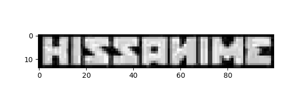
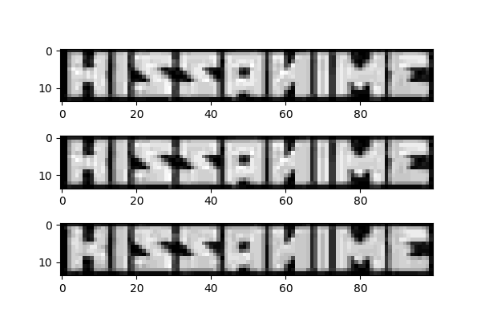

# waterdown

Remove image watermarks with numpy

## Project goals

- [ ] Use numpy to detect and reproduce the original watermark (produce output from which to load for future use)
  - [x] ⇒ [img/doc/wm_greyscale_multi.gif](img/doc/wm_greyscale_multi.gif)
  - [ ] ⇒ consensus watermark estimate TBC
- [ ] Inpaint/offset the watermark region so as to unmark the image
- [x] Calculate the alpha opacity of the watermark
  - 24/255, or around 9.4%
- [ ] Apply to a gif (of a different size to the still images)

## Example usage (interactive)

So far all I've done is obtain some still/animated images (from
[_Kirby Of The Stars_](https://en.wikipedia.org/wiki/Kirby_of_the_Stars)!)
and to focus on the watermark region in question.


The file `kirby003_01a.png` can be used to extract the binary watermark,
since it falls in a region of black screen fill.

```py
img = read_image('kirby003_01a.png')
watered = img[6:20, 9:109]
gr_wm = rgb2grey(watered)
```

The values in `gr_wm` are a greyscale equivalent to the RGB(A) values
given by `imageio.imread` (i.e., the watermark is white with low opacity,
so there's no point representing it as 3 colours).

An example value can be shown to be simply a decimal interpretation of RGB:

- `watered[10,10]` ⇒ `Array([ 24,  24,  24, 255], dtype=uint8)`
- `gr_wm[10,10]` ⇒ `0.09411764705882353`
- `24/255` ⇒ `0.09411764705882353`

Watermark removal should then just be a matter of offsetting the value stored
above in the variable `watered`...

```py
normed = gr_wm * (1/np.max(gr_wm))
plt.imshow(normed, cmap=plt.get_cmap('gray'))
plt.show()
# fig = plt.figure(figsize=(6,2))
# plt.imshow(normed, cmap=plt.get_cmap('gray'))
# fig.savefig('../img/doc/wm_greyscale.png')
```



Then for greater accuracy, do it twice more:

```py
img2 = read_image('kirby003_01b.png')
img3 = read_image('kirby003_01c.png')
gr_wm2 = rgb2grey(img2[6:20, 9:109])
gr_wm3 = rgb2grey(img3[6:20, 9:109])
normed2 = gr_wm2 * (1/np.max(gr_wm2))
normed3 = gr_wm3 * (1/np.max(gr_wm3))
# assert np.min(normed2) == np.min(normed3) == 0
# assert np.max(normed2) == np.max(normed3) == 1

fig=plt.figure(figsize=(6, 4))
fig.add_subplot(3,1,1)
plt.imshow(normed, cmap=plt.get_cmap('gray'))
fig.add_subplot(3,1,2)
plt.imshow(normed2, cmap=plt.get_cmap('gray'))
fig.add_subplot(3,1,3)
plt.imshow(normed3, cmap=plt.get_cmap('gray'))
fig.savefig('../img/doc/multi_wm_greyscale.png')
```



...and as animated GIF:

```py
fig = plt.figure(figsize=(6,2))
plt.imshow(normed2, cmap=plt.get_cmap('gray'))
fig.savefig('../img/doc/wm2_greyscale.png')

fig = plt.figure(figsize=(6,2))
plt.imshow(normed3, cmap=plt.get_cmap('gray'))
fig.savefig('../img/doc/wm3_greyscale.png')

from subprocess import call
call(['convert', '../img/doc/wm*_grey*.png', '../img/doc/wm_greyscale.gif'])
```


...for good measure, do the same for a couple non-black backgrounded,
dark grey backgrounded images (`kirby003_03a.png` and `kirby003_03b.png`).

```py
img4 = read_image('kirby003_03a.png')
img5 = read_image('kirby003_03b.png')
gr_wm4 = rgb2grey(img2[6:20, 9:109])
gr_wm5 = rgb2grey(img3[6:20, 9:109])
normed4 = (gr_wm4 - np.min(gr_wm4)) * (1/np.max(gr_wm4))
normed5 = (gr_wm5 - np.min(gr_wm5)) * (1/np.max(gr_wm5))
# assert np.min(normed4) == np.min(normed5) == 0
# assert np.max(normed4) == np.max(normed5) == 1
```

...and an animation with all 5:

```py
call(['convert', '../img/doc/wm*_grey*.png', '../img/doc/wm_greyscale_all.gif'])
```


